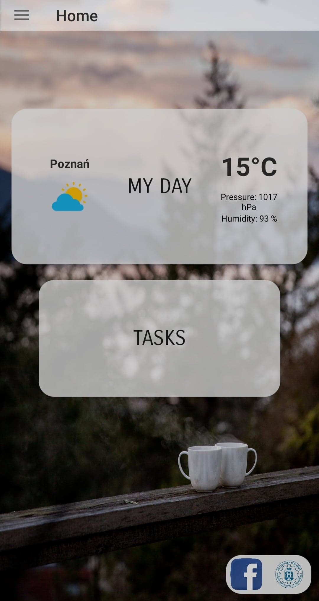
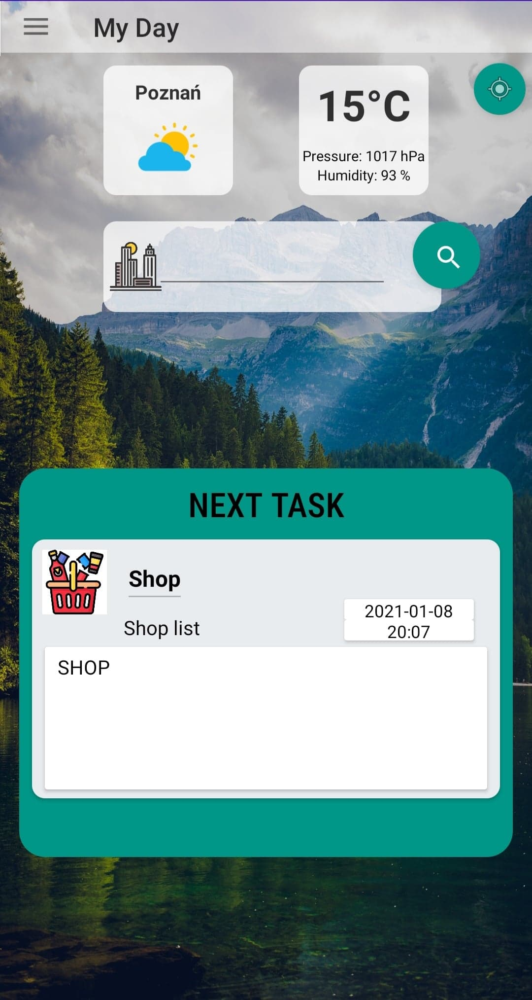
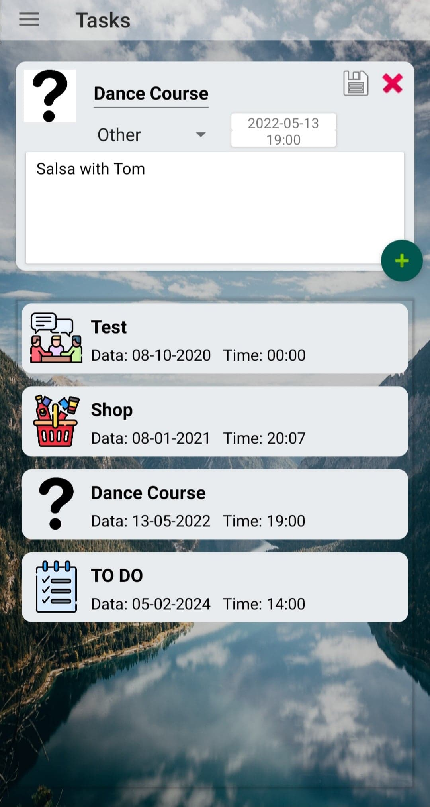

# Projekt Aplikacje Mobilne: Asystentoro 
Projekt został stworzony w Android Studio w języku Kotlin 1.3.72 . Apka ma na celu wspomóc studentów Politechniki Poznańskiej w organizacji i zarządzaniu czasem.

## Założenia aplikacji: 
### Funkcje aplikacji:
    - mój dzień: pogoda, najbliższe zadania 
        - Pogoda, data
        - Wizytówka z najbliższym zadaniem z jego opisem
    - moje zadania:
        - Zarządzanie starymi i nowymi zdaniami
        - Baza danych online oparta na darmowej usłudze GraphCMS (graphql)

## Działanie aplikacji:
#### Moje zadania
Aplikacja ściśle współpracuje z bazą danych. W aplikacji użyliśmy Apollo framework do komunikacji z nią. Każda ingerencja jest wsyłana do bazy danych i zapisywana. Sama baza danych została zaimplementowana w najprostszy sposób, aby ukazać zasadnicze jej działanie. 

#### Mój dzień
Ten fragment został stworzony jako prezentacja dnia. Ściśle współpracuje z funkcją Moje zadania. Wyświetla najbliższe zadania oraz pogodę. Pogodę można otrzymać na dwa sposoby:
		- za pomocą wpisania miejscowości
		- za pomocą GPSa
Sama pogoda pobiera dane z [openweathermap.org](http://openweathermap.org "openweathermap.org") 

## Prezentacja zdjęć:

Home: 

>Prezentujemy na ekranie głównym informacje o pogodzie, znajduje się tutaj szybki dostęp do Mojego dnia i Zadań. Na dole ekranu znajdują się ważne przyciski dla studenta z polibudy.

My Day 

>Ustawienia pogody oraz wyświetlanie najbliższego zadania

Tasks 

>Zarządzanie listą zadań oraz jej podgląd. (Plusem dodaje się nowe zadanie)

Chcieliśmy dopracować aplikację i zabezpieczyć przed krytycznymi błędami, ale niestety nie było nas stać na beta testerów :) **Przepraszam za niedogodności!!!**

