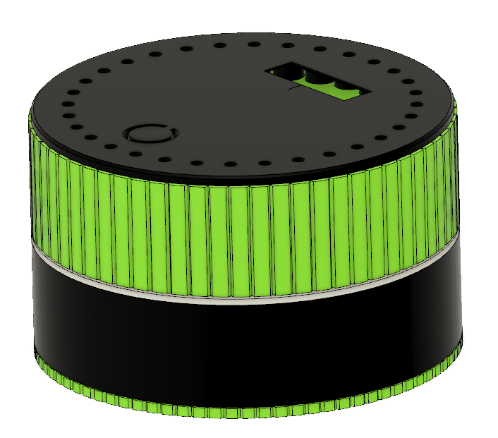

# Encodoro -> Aplikacja Mobilna 

Głównym załozeniem będzie połączenia aplikacji na telefonie z Encodoro (projekt na SM)

## O Encodoro 

### Co to w sobie ma
1. Górny ring RGB - 32 unikalnie adresowane diody 
1. Przycisk na górnej obudowie
1. Wyświetlacz oled 128x32 
1. Cała zielona część jest pokrętłem, który również jest interfejsem wejścia - Enkoder *(ciekawe skąd nazwa projektu na SM się wzięła)* 🙄
1. Dolny ring RGB (biały element), składający się z 6 unikalnie adresowanych diod RGB
1. Zasilanie bateryjne
1. ESP32 w środku, które pozwala łączyć się za pomocą WiFi || Bluetooth 

### Jak działa?
Na ten moment encodoro ma zainmplementowaną fukcję odliczania czasu techniką pomodoro 

[Tutaj link do PDF jak to działa na Encodoro](encodoro.pdf) 

## Propozycja Projektu
Z mojej strony miałbym taką propozycję, aby aplikacja korzystała z encodoro jak z "smart zegarka", czyli:
### Funkcje
- Za pomocą aplikacji będzie można wystartować licznik pomodoro na enkodoro (wtedy widać postęp i na telefonie i na encodoro, wszystkie powiadomienia są na obu - ale na aplikajci tel można je wyciszyć -> działa w tle) + pauzowanie i startowanie ponowne (połącznie po bluetooth)
- Encodoro będzie pełniło również funkcję takiej stacyjki bazowej na biurku, dzięki której będzie można odbierać powiadomienia z telefonu (czyli coś jak smart zegarek, jeśli jakieś powiadomienie się pojawia to wyskakuje komunikat na ekranie + diody mrygają)
- **Propozycje jak to można bardziej rozbudować?** Możemy dodać do aplikacji jeszcze sterowanie innymi urządzeniami (jakieś przekaźniki podłączone po wifi -> esp-01 lub podobne) tylko to trochę odchodzi od wizji zamysłu Telefon <-> Encodoro (stacja powiadomień z telefonu)

### Podział pracy
To tylko propozycja jak to może wyglądać
- Ania - Aplikacja która będzie miała zaimplementowane (Pomodoro na telefonie + powiadomienia)
- Arek - Kod Aplikacji mobilnej odpowiedziany za komunikację
- Łukasz - Kod na Encodoro (odbsługa komunikatów z i do telefonu + interfejs użytkownika)

> Pamiętajcie, że zawsze można rozbudować funkcjonalności, nie ma co za dużo brać na klatę od razu. Jeśli szybko pójdzie i kodziaż będzie dobrze napisany <del>spaghetti</del> i okomentowany żeby można było się łatwo odnaleźć. 